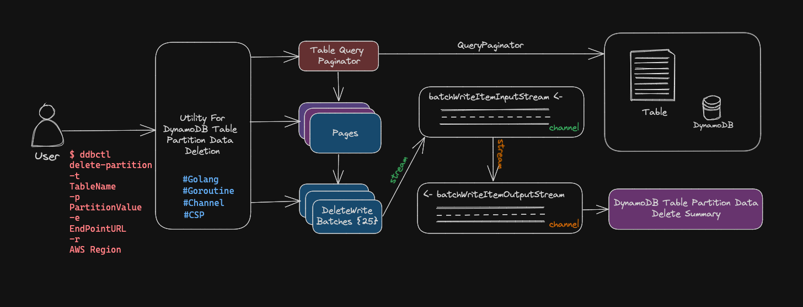
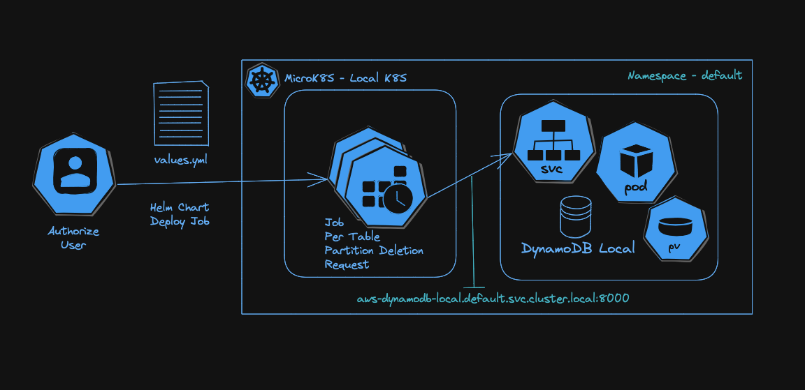

# Utility to Delete DynamoDB Table Partition Data

Deleting DynamoDB Table Partition Data with Go Concurrency.

## Overview

The DynamoDB Delete Table Partition Data Utility, developed in Golang and utilizing the AWS SDK v2, capitalizes on Golang's built-in concurrency features, like Goroutines and Channels. This design enables swift, parallel data deletion within a DynamoDB table, which is especially beneficial when managing large datasets. 

## Solution



The utility utilizes DynamoDB's QueryPaginator to efficiently paginate through large datasets. It employs Go's concurrency primitives, Goroutines, and Channels to parallelize data deletion in batch form. Each Goroutine handles item deletion at the page level, breaking down the data into batches and processing them concurrently. The utility's primary goal is to delete large-scale partition data with minimal execution time.

## Usage 

### Local

```bash
$ ddbctl delete-partition --table-name <<table-name>> --partition-value <<partition-value>> --endpoint-url <<optional-endpoint-url> --region <<optional-aws-region>>

$ # skip confirmation
$ ddbctl delete-partition --table-name <<table-name>> --partition-value <<partition-value>> --endpoint-url <<optional-endpoint-url> --region <<optional-aws-region>> --skip-confirmation
```

### Docker

```bash
$ # build local image
$ # make docker_build
$ docker run go-dynamodb-partition-delete:latest /ddbctl delete-partition -t Orders -p A -e http://192.168.0.139:8080 -r us-east-1 -s
```

or

```bash
$ # pulling docker image from docker.io/jittakal/go-dynamodb-partition-delete:latest
$ docker run jittakal/go-dynamodb-partition-delete:latest /ddbctl delete-partition -t Orders -p A -e http://192.168.0.139:8080 -r us-east-1 -s
```

### Helm - Kubernetes Job

```bash
$ # Modify helm/ddebctl-job/values.yaml and deploy
$ cd helm
$ helm install orders ./ddbctl-job -f ./ddbctl-job/values.yaml

$ # List deployment details
$ helm list

$ # Delete Job
$ helm delete orders
```



You can test the utility by deploying a Kubernetes Job using Helm chart with the provided details, such as TableName, PartitionValue, EndpointURL, and AWS Region in values.yaml file. Assuming that DynamoDB Local is running as a Kubernetes Service.

## Limitations

- Supports only string-type Partition Keys.
- Limited to DynamoDB local connections at this time.

## What Next - ToDo?

- **Enhance Partition Key Support**: Expand the utility to support additional partition key types, offering even more versatility for different data structures.

- **Connect to DynamoDB Remotely**: Enable connectivity to DynamoDB services beyond the local environment, broadening the scope of accessible resources.

- **Store Summary in DynamoDB Table**: Enhance the utility to store the deletion summary directly in a DynamoDB table instead of logging. This will provide a more structured and persistent way to track and manage the results of partition data deletions.

- **Leverage Go's Concurrency Patterns**: Implement Go's advanced concurrency patterns on top of existing primitives to further optimize performance and efficiency.

- **Distributed Processing**: Extend the utility's capabilities by distributing the data deletion process across multiple pods within a Kubernetes Job, allowing for more efficient handling of extensive datasets.

## Reference

- [Docker Hub Image](https://hub.docker.com/repository/docker/jittakal/go-dynamodb-partition-delete/general)
- [Running Local DynamoDB within MicroK8S](https://medium.com/@jittakal/running-dynamodb-local-within-microk8s-a-step-by-step-guide-with-sample-code-38aac0aea803)